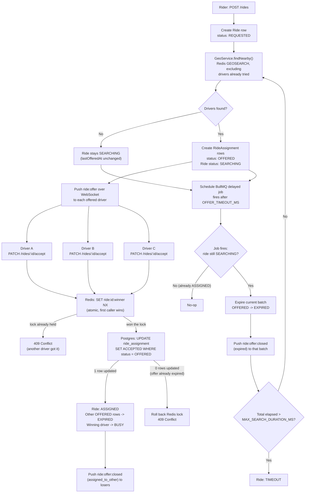

# real-time-driver-allocation

> **Reviewing this for the concurrency requirement?** Skip straight to
> [Concurrency verification](#concurrency-verification) — two ways to prove exactly one
> driver wins when several accept the same ride at once, both runnable in one command
> with no manual setup.
>
> **Timing:** by default an offer batch expires after 30s and a ride gives up after 5
> minutes (`OFFER_TIMEOUT_MS`, `MAX_SEARCH_DURATION_MS` in `.env`). To watch a retry or
> a `TIMEOUT` happen without waiting that long, lower them before starting the app, e.g.
> `OFFER_TIMEOUT_MS=5000 MAX_SEARCH_DURATION_MS=15000 npm run start:dev`.
>
> Full setup and design details start below.

Real-Time Driver Allocation System for vybe cabs. When a rider requests a ride, the
system identifies the nearest available drivers, notifies multiple drivers
simultaneously, and ensures that only one driver is successfully assigned, based on
the first acceptance.

Stack: NestJS (TypeScript), PostgreSQL, Redis, BullMQ, WebSockets (Socket.IO).

## Architecture overview



The interesting part of this diagram is the branch under "won the lock": winning the
Redis race is necessary but not sufficient — the driver's own offer row still has to be
`OFFERED` in Postgres at that instant, which is what makes the "accept lands right after
timeout fires" edge case resolve correctly (see [Concurrency guarantee](#concurrency-guarantee)
below).

## Prerequisites

- Node.js 22+
- Docker + Docker Compose

## Setup

1. Copy the environment file:

   ```bash
   cp .env.example .env
   ```

2. Start Postgres and Redis:

   ```bash
   docker compose up -d
   ```

3. Install dependencies:

   ```bash
   npm install
   ```

4. Run the app:

   ```bash
   npm run start:dev
   ```

   The app starts on `http://localhost:3001` (see `PORT` in `.env`).

## Services

`docker-compose.yml` brings up:

- **postgres** — Postgres 16, exposed on host port `5434` by default (mapped to
  container port `5432`) to avoid clashing with other local Postgres instances.
- **redis** — Redis 7, exposed on host port `6380` by default (mapped to container
  port `6379`), same reasoning.

Both host ports are configurable via `.env` (`POSTGRES_PORT`, `REDIS_PORT`) if `5434`
or `6380` are already taken on your machine.

To stop the services:

```bash
docker compose down
```

To stop and wipe data volumes:

```bash
docker compose down -v
```

## Project layout

- `src/app.module.ts` — root module; wires up `ConfigModule`, `TypeOrmModule` (Postgres),
  `BullModule` (job queue), and `RedisModule`.
- `src/redis/redis.module.ts` — global module exposing a shared `ioredis` client under
  the `REDIS_CLIENT` injection token.
- `src/drivers/` — driver profile (Postgres) + live location (Redis GEO), and the geo
  search endpoint.
  - `geo.service.ts` — wraps `GEOADD`/`GEOSEARCH`/`ZREM` against a searchable
    `drivers:geo:available` set, plus a separate last-known-location cache.
  - `drivers.service.ts` — bridges driver status (Postgres) and geo membership (Redis).
- `src/rides/` — ride lifecycle, driver offers, and concurrency-safe acceptance.
  - `rides.service.ts` — ride creation, offer batching, accept (with the atomic
    concurrency guard), and the timeout/retry handler.
  - `offer-timeout.queue.ts` / `offer-timeout.processor.ts` — BullMQ delayed job that
    fires when an offer batch's window elapses.
  - `ride-offers.gateway.ts` — WebSocket push (`ride:offer`, `ride:offer:closed`); see
    [Driver notification](#driver-notification-websocket) below.
- `test/ride-concurrency.e2e-spec.ts` / `scripts/verify-concurrency.sh` — the concurrency
  verification test and script (see [Concurrency verification](#concurrency-verification)
  below).

## Ride lifecycle

`REQUESTED → SEARCHING → ASSIGNED` (success) or `SEARCHING → TIMEOUT` (nobody accepted
within the overall search window). `CANCELLED`/`COMPLETED` exist in the state enum for a
fuller lifecycle but aren't wired to an endpoint yet.

Per-driver offers move `OFFERED → ACCEPTED` (won) or `OFFERED → EXPIRED` (lost the race
or the batch's offer window elapsed).

Two timers govern retries (both configurable via `.env`, defaults below):

- `OFFER_TIMEOUT_MS` (default `30000`, 30s) — how long one batch of offered drivers has
  to respond before it's retried with the next-nearest drivers, excluding everyone
  already tried for that ride.
- `MAX_SEARCH_DURATION_MS` (default `300000`, 5 minutes) — total time budget across all
  retries before the ride gives up and moves to `TIMEOUT`.

Both are read from `.env` — see the note at the top of this README if you want to speed
them up while testing.

## Driver notification (WebSocket)

The brief allows WebSockets, SSE, polling, or a simulated notification log for
"notify multiple drivers simultaneously" — this project uses **WebSockets** (via
`@nestjs/websockets` + Socket.IO, `src/rides/ride-offers.gateway.ts`).

**Why, specifically for this system:** offer windows are short by design
(`OFFER_TIMEOUT_MS` defaults to 30s, and can reasonably be tuned much lower — we ran it
at 3-10s while testing). A polling driver app would need to poll faster than that
interval to reliably see an offer before it expires, which is either wasteful (polling
constantly "just in case") or lossy (polling too slowly and missing the window
entirely). A WebSocket push has neither problem — the server notifies the instant an
offer is created, with no interval to tune and no missed windows. Given how central the
offer-timeout mechanic is to this system, that tradeoff mattered enough to justify the
extra moving part over the simpler polling/log alternatives.

Importantly, **this gateway is notification-only and has no bearing on correctness** —
drivers still call the ordinary REST `PATCH /rides/:id/accept` to actually accept, so
the entire concurrency guarantee above is unaffected by this section; it would hold
identically if this gateway didn't exist.

**Connecting** (driver identifies itself via a `driverId` query param on the socket
handshake — no auth token, kept simple for this scope):

```js
const socket = io("http://localhost:3001", { query: { driverId: "<driver-uuid>" } });

socket.on("ride:offer", (payload) => {
  // { rideId, pickupLat, pickupLng, dropoffLat, dropoffLng, distanceKm, offerExpiresInMs }
});

socket.on("ride:offer:closed", (payload) => {
  // { rideId, reason: "assigned_to_other" | "expired" }
});
```

- `ride:offer` — pushed to every driver in a batch the instant it's created.
- `ride:offer:closed` — pushed to a driver when their specific offer stops being live:
  `assigned_to_other` if someone else won the ride, `expired` if the batch's offer
  window elapsed with nobody accepting.

## Concurrency guarantee

Acceptance is guarded two ways, both enforced by the data stores themselves rather than
in-process locks (so it holds correctly even across multiple app instances):

1. A Redis `SET ride:<id>:winner <driverId> NX` — first driver to successfully set this
   key wins the ride-level race.
2. A conditional Postgres update on the winner's own offer —
   `UPDATE ride_assignment SET status = 'ACCEPTED' WHERE ... AND status = 'OFFERED'`.
   This is what actually closes the "driver accepts just after the timeout fires" edge
   case: the timeout worker's batch-expiry update uses the identical
   `WHERE status = 'OFFERED'` guard, so whichever operation's `UPDATE` commits first for
   a given row wins — deterministically, not by timing heuristics.

## Concurrency verification

Two ways to prove exactly one driver wins when many accept the same ride at once —
both create their own test drivers, so there's no manual setup needed:

**Automated test** — creates 8 drivers, fires all their `accept` calls simultaneously,
asserts exactly one `200`/`ACCEPTED` and checks the database directly:

```bash
npm run test:e2e
```

**Standalone script** — same idea, but prints every driver's response live so you can
watch the race resolve in real time:

```bash
./scripts/verify-concurrency.sh
# or, with more drivers:
DRIVER_COUNT=20 ./scripts/verify-concurrency.sh
```

```
== Firing all 5 accept calls at the exact same instant ==

== Results ==
  d8c39058-... -> HTTP 409 -> {"message":"Ride ... was already accepted by another driver", ...}
  4afcac3c-... -> HTTP 409 -> {"message":"Ride ... was already accepted by another driver", ...}
  5f3c6af1-... -> HTTP 200 -> {"ride":{...,"status":"ASSIGNED","assignedDriverId":"5f3c6af1-..."},"outcome":"ACCEPTED"}
  d9c6ca69-... -> HTTP 409 -> {"message":"Ride ... was already accepted by another driver", ...}

PASS: exactly 1 of 5 simultaneous accept calls succeeded.
```

## API usage

Base URL below assumes the default `PORT=3001`. All examples are real, run-tested
request/response pairs from this app.

### 1. Create a driver

```bash
curl -X POST http://localhost:3001/drivers \
  -H "Content-Type: application/json" \
  -d '{"name": "Asha", "phone": "+15550001111"}'
```

```json
{
  "id": "0faaecaa-8a50-47f7-a0b3-1b901bf65781",
  "name": "Asha",
  "phone": "+15550001111",
  "vehicleNumber": null,
  "status": "OFFLINE",
  "createdAt": "2026-07-15T07:41:56.856Z",
  "updatedAt": "2026-07-15T07:41:56.856Z"
}
```

### 2. Mark a driver available (with location)

Going `AVAILABLE` requires a location in the same call (or falls back to the driver's
last-known location if omitted — see the write-up for why). `BUSY`/`OFFLINE` don't.

```bash
DRIVER_ID=0faaecaa-8a50-47f7-a0b3-1b901bf65781

curl -X PATCH http://localhost:3001/drivers/$DRIVER_ID/status \
  -H "Content-Type: application/json" \
  -d '{"status": "AVAILABLE", "lat": 40.7589, "lng": -73.9851}'
```

### 3. Update a driver's location (ongoing GPS pings)

```bash
curl -X PATCH http://localhost:3001/drivers/$DRIVER_ID/location \
  -H "Content-Type: application/json" \
  -d '{"lat": 40.7595, "lng": -73.9845}'
```

### 4. Search nearby available drivers

```bash
curl "http://localhost:3001/drivers/nearby?lat=40.7589&lng=-73.9851&radiusKm=5&limit=10"
```

```json
[
  {
    "id": "0faaecaa-8a50-47f7-a0b3-1b901bf65781",
    "name": "Asha",
    "status": "AVAILABLE",
    "distanceKm": 0.1004
  }
]
```

### 5. Request a ride

Runs the geo search and offers the nearest available drivers (up to 5 by default) in
one step.

```bash
curl -X POST http://localhost:3001/rides \
  -H "Content-Type: application/json" \
  -d '{
    "riderId": "rider-123",
    "pickupLat": 40.7589,
    "pickupLng": -73.9851,
    "dropoffLat": 40.7700,
    "dropoffLng": -73.9600
  }'
```

```json
{
  "ride": {
    "id": "cb2771e2-d77b-4d76-8652-fb1e3d832c2e",
    "riderId": "rider-123",
    "status": "SEARCHING",
    "assignedDriverId": null,
    "lastOfferedAt": "2026-07-15T13:58:08.268Z"
  },
  "offeredDrivers": [
    { "id": "0faaecaa-8a50-47f7-a0b3-1b901bf65781", "name": "Asha", "distanceKm": 0.1004 }
  ]
}
```

### 6. Driver accepts the ride

```bash
RIDE_ID=cb2771e2-d77b-4d76-8652-fb1e3d832c2e

curl -X PATCH http://localhost:3001/rides/$RIDE_ID/accept \
  -H "Content-Type: application/json" \
  -d "{\"driverId\": \"$DRIVER_ID\"}"
```

Success:

```json
{
  "ride": { "id": "cb2771e2-d77b-4d76-8652-fb1e3d832c2e", "status": "ASSIGNED", "assignedDriverId": "0faaecaa-8a50-47f7-a0b3-1b901bf65781" },
  "outcome": "ACCEPTED"
}
```

A losing driver (or the same driver retrying) instead gets a `409`:

```json
{ "message": "Ride cb2771e2-d77b-4d76-8652-fb1e3d832c2e was already accepted by another driver", "error": "Conflict", "statusCode": 409 }
```

...or, if calling back with the *same* winning driver, a `200` with
`"outcome": "ALREADY_ACCEPTED"` — accept is idempotent, never double-processed.
